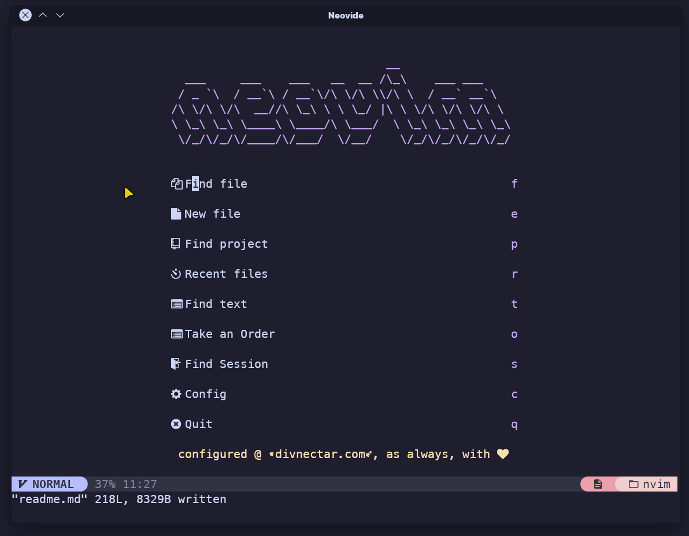

# Vim config
Started from the [NeoCode](https://github.com/Sewdohe/NeoCode/tree/main) template. ([Discord](https://discord.gg/9tZq3WrU4p))

NeoCode with it's new Catppuccin look running in Neovide using the multigrid flag for
fancy animations

Installer works for:
  - The following Linux Distros:
	  - Ubuntu
	  - Fedora
  - Windows 10/11
  - Mac OSX

## Community

This project is actually growing! I'm stoked!! Join the [Discord](https://discord.gg/9tZq3WrU4p)

## Dependencies:

The new installer script should manage/download all dependencies automatically now. You no longer need to install deps manually.

## Instructions

1. Clone/Download repo to somewhere on your PC. The config will need to remain where it's placed after installation, so place it somewhere you don't mind it living!
2. enter the directory where you downloaded the repo using your terminal/console and run the python installer file using `python installer.py`
3. watch as the installer does **everything** for you

## FAQ

- How do I get language support for a certian language?
type `:LspInstall` while the file is open and it should find a language server for you.

- How do I get syntax support for a language?
type `TSInstall ` and press `<tab>` and you will get an autocomplete window of available parsers.

## Commonly Used Keybinds:

> leader key refers to the comma ( , ) key on your keyboard!

### VS Code Features:

* **Command Pallete:**
I can't use crtl+shift+p as keybind in vim, so the command pallette is used with `crtl+k`
* **Quick Open:**
Quick open is used to quickly open files in a directory. Call it with `crtl-p`.
* **Sidebar Toggle:**
Vim doesn't have a sidebar to hold differnt features. We'll use `crtl+b` to open the Filetree as a sidebar.
* **Commenting / Uncommenting:**
Use `<leader><leader>c` to comment a line or multiple lines. The leader key is the , key on your keyboard. So the key chord would be `,,c`.
* **Show Symbols:**
Press `ctrl+o` to view the symbols sidebar. This lets you browse code by the functions, essentially.
* **Global Find / Find in Project**
This feature is mapped to `<leader><leader>g` the G is for "live-**G**rep". Grep is a term that vimmers use to say searching, basically.
* **Indent / Unindent Lines:**
Use the `<` and `>` keys to indent and un-indent text.
* **Search open buffers:**
Use `<leader><leader>b` to search and quickly open an already open buffer.
* **Formating Documents:**
Use `<leader><leader>f` to auto-format a document using the language server.
* **move to next / prev diagnostic**: 
Use `[d` or `]d`.

### LSP Commands

Most lsp command (command pertaining to the language server) are prefixed with the space key instead of the leader
key for memoralibilitys sake

* **Rename Symbol:**
`F2` or `space-rn`
* **Format Buffer/Document**
`space-f`
* **Perform Code Action**
`space-ca`
* **Goto Definition**
`space-d`
* **Goto Declaration**
`space-D`
* **Signature Help**
`ctrl-i`

### UI Navigation

* **Return to Dashboard**
`<leader><leader>h`
* **Popup Terminal:**
`ctrl + ~` (the tilde key without shift) will give you a floating terminal that you can run commands in
* **Switch Tabs:**
`gt` and `gy` OR `shift+h` and `shift+l`
* **Close Tabs:**
* the close tab button has been removed, if using a mouse please use right-click to close an open tab
* **Jump up or down by pages:**
`shift+j` and `shift+k`
* **Switch Windows:**
`ctrl+w then h,j,k, or l`
* **close buffer/tab:**
`qb`
* **Quick-exit Insert Mode:**
`qq`

### VS Code Support
This configuration now supports being ran inside VS Code itself via the "Neovim VS Code Plugin".

When using the configuation inside VS Code it just uses keybinds, legendary, and settings.lua. Still makes for a pretty seamless experience when compared with VS Code native features IMO. More VS Code keybinds to come soon!

Due to limitations of running Neovim inside VS Code, we can't have fuzzy finders and whatnot render, so you'll need to use the VS Code counterparts (such a ctrl+p and strl+shift+p)
